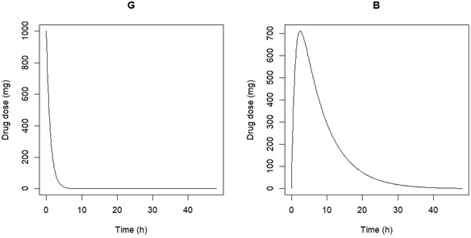
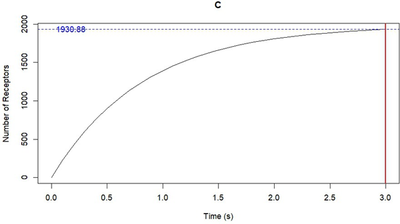
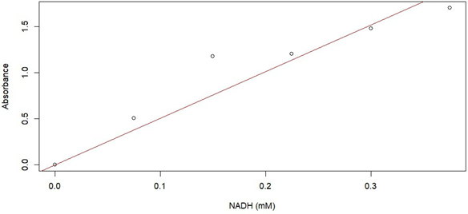
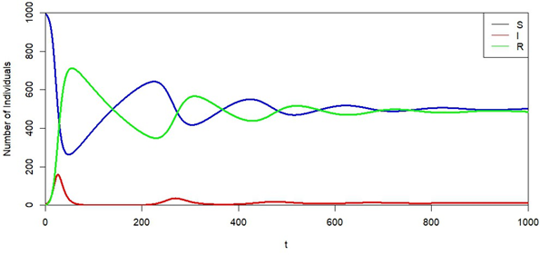

# Pharmacokinetics-Systems-Biology-Models
# 🧬 Systems Biology Modeling

This project showcases four fundamental biological models implemented in R:

1. **Pharmacokinetics ODE modeling**
2. **Ligand–receptor binding kinetics**
3. **Enzyme kinetics with curve fitting**
4. **Epidemiological modeling (SIRS and SEIRS)**

All simulations were executed in R using base modeling functions and `deSolve`.

---

## 🧠 Skills Demonstrated

| Section | Topic | Skills |
|--------|-------|--------|
| 2.1 | Pharmacokinetics | ODE systems, gut–blood drug modeling |
| 2.2 | Binding Kinetics | Mass-action binding simulation, equilibrium |
| 2.3 | Enzyme Kinetics | Michaelis–Menten curve fitting and parameter extraction |
| 2.4 | Epidemiology | SIRS/SEIRS modeling using `deSolve`, figure reproduction |

---

## 🖼️ Output Figures

| Model | Output |
|-------|--------|
| Pharmacokinetics |  |
| Ligand Binding |  |
| Enzyme Kinetics |  |
| SIRS Simulation |  |
| SEIRS Simulation |  |

---

## 📂 Project Structure

```
Systems-Biology-Modeling/
├── src/
│   ├── Systems Biology Modeling.Rmd
├── results/
│   ├── pharmacokinetics_simulation.png
│   ├── ligand_binding_dynamics.png
│   ├── enzyme_kinetics_fit.png
│   ├── SIRS_simulation.png
│   └── SEIRS_simulation.png
├── data/
├── README.md
```

---

## 📦 How to Reproduce

1. Open the relevant `.Rmd` files in RStudio
2. Run each simulation line-by-line
3. Ensure packages like `deSolve`, `minpack.lm`, and `ggplot2` are installed

---

## 👨‍💻 Author

**Fares Ibrahim**  
Bioinformatician | Systems Biology | Pharmacokinetics  
🔗 [GitHub](https://github.com/Fares77-a11y)

---

## 📄 License

MIT License — see `LICENSE` file for terms.
